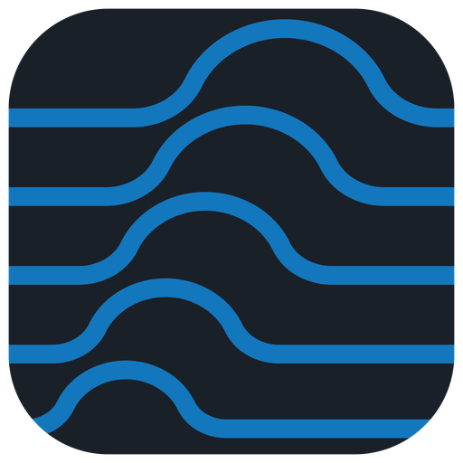

<p align="center">
  
</p>

<h1 align="center">
  Swell<br>
  <sub>Intrinsic Optical Signal Analysis</sub>
</h1>

[](https://www.python.org/downloads/)
[](https://github.com/ParrishLab/Swell/actions/workflows/ci.yml)
[](https://swell.readthedocs.io/)
[](https://github.com/ParrishLab/Swell/releases)
[](LICENSE)

Swell is an open-source desktop application for intrinsic optical signal
imaging analysis, focused on identifying spreading depolarization, cortical
spreading depression, and spreading depression (SD) events in image stacks and
producing event-level segmentation and metrics outputs.

## Download

Download the latest packaged desktop build:

- [macOS Apple Silicon](https://github.com/ParrishLab/Swell/releases/download/v0.1.8/sdapp-macos-arm64.zip)
- [Windows x64](https://github.com/ParrishLab/Swell/releases/download/v0.1.8/sdapp-windows-x64.zip)
- [All releases](https://github.com/ParrishLab/Swell/releases)

Packaged builds do not require a local Python setup. See
[Installation](docs/installation.md) for first-run model setup, platform notes,
and source installation instructions.

The app is organized around a two-window workflow:

- **Host window**: load image stacks, mark event ranges, manage project state,
  review auto-detected candidates, attach DC traces, and export results.
- **Analysis window**: open a single event, refine masks with interactive tools,
  run SAM-2 propagation, inspect temporal diagnostics, and save analysis
  artifacts back to the project.

## Features

- Import PNG, JPG, BMP, TIFF, and multi-page TIFF image stacks with natural
  frame ordering and grayscale conversion.
- Catalog events manually or review auto-detected SD candidates from the host
  window's temporal grid-coherence workbench.
- Configure event bounds, baseline frame ranges, global metrics defaults, scale
  calibration, and regions of interest.
- Attach electrophysiological DC traces and keep trace data aligned with the
  project timeline.
- Open event-scoped analysis workspaces with prompt, box, brush, eraser, fill,
  and persistent include/exclude region tools.
- Run SAM-2 propagation forward, backward, or bidirectionally when model
  dependencies and checkpoints are available.
- Manage model checkpoints from the app, including default downloads, local
  model selection, checksum validation, and project/model compatibility checks.
- Review masks with ghost outlines, leverage heatmaps, timeline markers, and
  jump-to-correction navigation.
- Import external masks and save reviewed masks, prompts, regions, and draft
  state into `.swell` projects.
- Save portable `.swell` project containers with optional embedded source images
  so projects can reopen after the original stack folder moves.
- Export raw and processed event images, baseline images, binary masks,
  ROI-cropped masks, overlays, contour maps, CSV/JSON/Markdown summaries,
  plots, and consolidated Excel workbooks.
- Calculate propagation speed, area recruited, relative area recruited, and
  ROI-based intensity metrics including baseline-normalized intensity change.

## Research Applications

Swell is designed for neuroscience image-analysis workflows involving intrinsic
optical signal imaging and optical imaging time-series data. It supports
spreading depolarization event detection, cortical spreading depression
analysis, SD wavefront segmentation, and quantitative reporting of propagation
speed, recruited area, relative area, and ROI-based intensity dynamics.

## Installation

### Packaged Releases

Packaged desktop builds are available from
[GitHub Releases](https://github.com/ParrishLab/Swell/releases).

See [docs/installation.md](docs/installation.md) for platform-specific setup,
first-run model onboarding, packaged-app warnings, and troubleshooting notes.

### From Source

Swell requires Python 3.12 or newer.

```bash
git clone https://github.com/ParrishLab/Swell.git
cd Swell
python3 -m venv .venv
source .venv/bin/activate
pip install -e .
```

Install optional model support for SAM-2 propagation:

```bash
pip install -e ".[model]"
```

Install developer and documentation dependencies:

```bash
pip install -e ".[dev,docs,model]"
```

On Windows, create and activate the virtual environment with:

```cmd
python -m venv .venv
.venv\Scripts\activate.bat
```

## Usage

Launch Swell from an editable/source install:

```bash
python -m swell.main
```

Or use the installed console script:

```bash
swell
```

On macOS, the repository also includes a helper script:

```bash
./run_mac.command
```

Run a non-interactive startup smoke check:

```bash
python -m swell.main --smoke-test
```

## Basic Workflow

1. Create a new project and choose an image folder or stack.
2. Mark events manually or use auto-detect to review candidate SD events.
3. Set event bounds, baseline frame settings, scale, FPS, and ROI defaults.
4. Open an event in the analysis window.
5. Add prompts, boxes, brush edits, fill operations, or persistent regions.
6. Run propagation when model support is configured, then use diagnostic
   overlays to find frames that need correction.
7. Save masks and analysis artifacts back to the `.swell` project.
8. Export selected events or the full project.

For the full walkthrough, see [docs/user-guide.md](docs/user-guide.md).

## Documentation

- [Installation](docs/installation.md)
- [User Guide](docs/user-guide.md)
- [Host Window Reference](docs/gui/host-window.md)
- [Analysis Window Reference](docs/gui/analysis-window.md)
- [Developer Guide](docs/developer-guide.md)
- [File Formats](docs/file-formats.md)
- [Glossary](docs/glossary.md)
- [Troubleshooting](docs/troubleshooting.md)
- [Changelog](CHANGELOG.md)

## Development

Install development dependencies:

```bash
pip install -e ".[dev,docs,model]"
```

Run the test suite:

```bash
pytest
```

Run the startup smoke check:

```bash
python -m swell.main --smoke-test
```

Build the documentation locally:

```bash
mkdocs serve
```

## Project Layout

```text
swell/             Application package
  host/            Host-window project and event management
  analysis/        Event-level segmentation workspace
  shared/          Shared services, metadata, and UI helpers
  resources/       Application resources and model catalogs
tests/             Pytest suite
docs/              User, developer, and release documentation
packaging/         Packaging configuration
scripts/release/   Release and packaging automation
```

## Packaging Status

Current macOS release builds are unsigned and not notarized. Gatekeeper warnings
are expected when opening packaged macOS builds for the first time. See
[docs/installation.md](docs/installation.md) for the recommended launch steps.

## Contributing

Contributions are welcome. Before opening a large change, please open an issue
or discussion describing the problem and proposed direction.

For code changes:

- Keep host, analysis, and shared-module boundaries intact.
- Add or update tests for behavior changes.
- Run `pytest` before submitting a pull request.
- Update user-facing docs when workflows, file formats, or packaging behavior
  changes.

## License

Swell is licensed under the BSD 3-Clause License. See [LICENSE](LICENSE).
