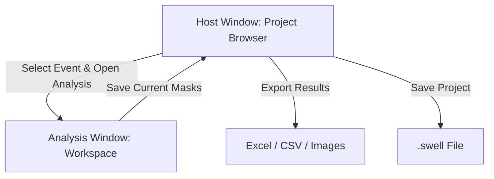

# Swell: Intrinsic Optical Signal Imaging Analysis for Spreading Depolarization

Welcome to the documentation for **Swell**, an open-source desktop application
for intrinsic optical signal imaging analysis. Swell helps researchers identify
spreading depolarization, cortical spreading depression, and spreading
depression (SD) events in image stacks, segment SD wavefronts, and export
quantitative event metrics.

## Two-Stage Architecture

Swell is organized around a dual-window workflow designed to keep project organization separate from pixel-level annotation tasks:

1. **Host Window (Project Browser)**: Coordinates project-level state. You load an entire image stack, mark chronological event frame ranges, manage global settings, and export final metrics, masks, and spreadsheets.
2. **Analysis Window (Event Segmentation)**: Opens as a child window for a selected event. Here, you use interactive select, point, brush, fill, and region tools along with SAM-2 model propagation to segment the SD wavefront across the event's frames.

---

## Key Capabilities

* **Multi-Format Image Support**: Load image sequences from PNG, JPG, BMP, TIFF, or multi-page TIFF stacks.
* **Unified Project Model (`.swell`)**: Save your entire workspace—including original image references, marked events, interactive prompts, and binary masks—in a single, portable file.
* **Interactive Tool Rail**: Annotate events using positive/negative points, bounding boxes, brushes, erasers, flood fill, and persistent include/exclude polygon regions.
* **SAM-2 Propagation**: Run automated mask propagation forwards and backwards across frames, with real-time progress indicators.
* **Diagnostic Overlays**: Track frame-to-frame mask changes using **ghost outlines** and identify regions needing corrections with a localized **leverage heatmap**.
* **Comprehensive Export**: Output event-level images, binary masks, overlay visualizations, temporal propagation speed, recruited-area graphs, ROI intensity metrics, and consolidated multi-sheet Excel reports.

---

## Where to Start

* **Getting Setup**: Go to the [Installation](installation.md) page to set up Swell and download the necessary segmentation model weights.
* **Step-by-Step Workflow**: Read the [User Guide](user-guide/index.md) to walk through creating a project, marking events, segmenting wavefronts, and exporting results.
* **UI Controls & Shortcuts**: Check the [GUI Reference](gui/host-window.md) to look up specific buttons, menu items, or keyboard hotkeys.
* **Troubleshooting**: Visit [Troubleshooting](troubleshooting.md) for help with common installation, runtime, or model-loading issues.
* **Citing the Project**: Refer to [Citation](citation.md) for BibTeX citations to include in academic work.
