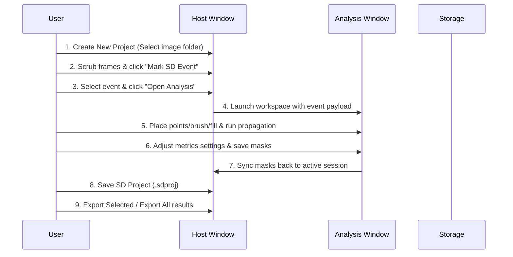

# User Guide

This guide walks you through the complete, end-to-end workflow of using SDApp, from first launch through segmentation, saving, and exporting analysis results.

---

## Workflow Overview

The core SDApp workflow consists of two main stages: event cataloging in the **Host Window** and pixel-level segmentation in the **Analysis Window**.



---

Upon launching SDApp for the first time, you will be prompted to set up the SAM-2 model checkpoint. Follow the onboarding prompt detailed in [Installation](installation.md#first-run-model-onboarding) to download or link model weights. Once complete, you will see the primary **Host Window**.

> [!TIP]
> **Forced Hardware Selection**: SDApp automatically selects the best available device for running segmentation (Apple MPS → NVIDIA CUDA → CPU). If you need to force a specific hardware backend (e.g. to run on CPU if an accelerator misbehaves), set the `SDAPP_DEVICE` environment variable to `cpu`, `mps`, or `cuda` before launching the application.

---

## 2. Creating a Project & Loading Image Stacks

All work in SDApp begins by importing an image sequence.

1. Click **New Project** in the Host Window's left panel or choose **File → New Project** from the menu.
2. In the folder browser, select the directory containing your image sequence.

### Image Folder Requirements
To ensure the stack loads successfully, verify your images meet these criteria:
* **Supported Formats**: `.png`, `.jpg`, `.jpeg`, `.bmp`, `.tif`, `.tiff`.
* **Multi-Page TIFF**: You can import a single multi-page `.tiff` file or a directory containing a series of single-page TIFFs.
* **Natural Sorting**: File names are sorted using natural alphanumeric ordering. For example, `frame_9.png` correctly precedes `frame_10.png` (instead of sorting alphabetically where `frame_10.png` would precede `frame_2.png`).
* **RGB Channel Conversion**: If multi-channel RGB images are detected, the app converts them to single-channel grayscale (Luma averaged or first-channel selection) to run the analysis.

---

## 3. Marking SD Events

Once the stack is loaded, you can browse frames using the slider at the bottom of the canvas or keyboard arrow keys.

1. Scrub to the first frame where the Spreading Depression (SD) wave appears.
2. Click **Mark SD Event** in the toolbar.
3. In the popup dialog:
    * Enter a **Label** (e.g., "Event_A").
    * Enter the **Start Frame** and **End Frame** numbers.
    * Click **Save**.
4. The event is added to the **Event List** on the left, and a colored timeline band is rendered overlaying the frame scrubber at the bottom of the window.

### Editing or Deleting Events
* To modify an event's bounds, select the event in the table and click **Edit Event**.
* To remove an event, select it and click **Delete Event**.
* **Safety Lock**: Arrow-key scrubbing and deleting shortcuts are automatically suppressed while your cursor is inside any text-entry fields (like the frame range inputs), preventing accidental timeline jumping.

---

## 4. Opening the Analysis Workspace

To segment an event:
1. Select the event in the Host Window's **Event List**.
2. Click the **Open Analysis...** button.
3. A child window will launch, loading only the frames corresponding to the selected event's range.

---

## 5. Segmenting Events (Interactive Tools)

The Analysis Window provides a specialized floating tool rail on the canvas and context-specific option bars below the status row:

```text
+-------------------------------------------------------------+
| [Menu Bar] File | Masks | Model                             |
+-------------------------------------------------------------+
| Status: Model Ready | Options: [Sensitivity: 15]           |
+-------------------------------------------------------------+
|  +----+  [Main Canvas Area]                                 |
|  | V  |  Interactive rendering of active event frame        |
|  | +  |                                                     |
|  | -  |  (Draw prompts, brush, boxes, persistent regions)   |
|  | K  |                                                     |
|  | B  |                                                     |
|  | E  |                                                     |
|  | G  |                                                     |
|  | R  |                                                     |
|  +----+                                                     |
+-------------------------------------------------------------+
| [Timeline Bar] (Leverage Heatmap, Scrubber, Progress)        |
+-------------------------------------------------------------+
```

### Prompt Selection Rail
* **Select (`V`)**: Hover over, select, move, or resize bounding boxes or persistent region vertices.
* **Positive Point (`+` / `=`)**: Left-click on the target SD wave structure to add positive prompt guides.
* **Negative Point (`-`)**: Left-click on background noise, artifacts, or healthy tissue to prevent the model from expanding there.
* **Box (`K`)**: Click and drag on the canvas to draw a bounding box enclosing the target. Only one box prompt is allowed per frame.
* **Brush (`B`) & Eraser (`E`)**: Manually draw or erase masks. Adjust the radius in pixels (1–50 px) using the options bar slider or **Shift + Mouse Wheel**.
* **Fill (`G`)**: Perform flood-fill operations.
    * *Add Mode*: Click to fill an empty region enclosed by masks/paint, falling back to pixel-intensity flood fill on open background.
    * *Remove Mode*: Click to erase the contiguous mask component under the cursor.
    * *Fill Holes*: A button in the options bar that fills all enclosed negative pockets inside the active mask.
* **Persistent Region (`R`)**: Draw include or exclude polygons that apply to a range of frames.
    * Left-click to place vertices. Click **Close Polygon** or double-click to complete.
    * Set the inclusive frame range and mode (Include/Exclude) in the option bar, then click **Commit Region**.
    * *Exclude regions* always take precedence where polygons overlap.

---

## 6. Running Mask Propagation

After placing point, box, or brush prompts on one or more anchor frames:

1. Click **Run Propagation** in the right dock panel.
2. The SAM-2 model propagates the mask from your anchor frames across all frames in the event range.
3. Propagation progress is displayed in real-time as a blue (`#1b75bc`) loading band on the timeline.
4. If you notice inaccuracies on other frames, pause or wait for propagation to complete, add correction prompts on those frames, and re-run propagation. The model will refine its predictions using the new anchor data.

---

## 7. Reviewing with Diagnostic Overlays

* **Ghost Outlines**: Enable ghost outlines in the right dock's *View* section. This displays contours of masks from neighboring frames (cyan/blue for past, magenta/rose for future) so you can track propagation velocity and shape consistency.
* **Leverage Heatmap**: The bottom timeline strip acts as a leverage heatmap. Red sections indicate high frame-to-frame mask transition differences (potential errors). Click **Jump to Suggested Correction** to immediately seek to the frame with the worst trouble score.

---

## 8. Setting Event Metrics

Before saving, configure quantitative parameters in the right dock's **Event Metrics** panel:
* **Frames Per Second**: Frame capture rate for temporal velocity metrics.
* **Physical Scale**: Pixel-to-physical size calibration (e.g., pixels per mm). Click the ruler icon to open the interactive calibration tool, allowing you to draw a line across a known physical distance.
* **Region of Interest (ROI)**: Restrict area calculations to a specific sub-rectangle or polygon.

---

## 9. Saving Masks & Project Portability

1. Click **Save Current Masks** at the bottom of the right dock to commit the active segmentations back to the project service.
2. Close the Analysis Window to return to the Host Window.
3. Save your project by selecting **File → Save SD Project** or clicking **Save SD Project**. This writes a compressed `.sdproj` file containing all events, prompts, regions, and masks.

### Opening a Project (Model Verification)
When reopening a `.sdproj` file, SDApp compares the model information saved in the project metadata with your active local model weights:
* If the models mismatch, a dialog asks whether to:
    * **Switch**: Load the model used to author the project.
    * **Continue**: Keep your active model (may alter future propagation results).
    * **Cancel**: Open in read-only mode (no model-based tools enabled).

---

In the Host Window:
1. Select one or more events from the table.
2. Click **Export Selected** or **Export All** to generate outputs on disk.
3. The exported folder contains:
    * `masks/`: Single-channel binary PNG masks for each frame.
    * `metrics/`: Frame-by-frame and summary spreadsheets, including:
        * `propagation_speed.csv`: Wavefront speed ($\mu m/sec$).
        * `area_recruited.csv`: Mask area recruitment ($mm^2$).
        * `intensity.csv`: Mean ROI pixel intensity and relative intensity change ($\Delta I / I_0$) over time.
    * `plots/`: Diagnostic charts showing propagation speed, area over time, and relative intensity changes (`intensity_delta_i_over_baseline_i.png`).
    * `metrics_combined.xlsx`: A consolidated Excel workbook with summary, frame metrics, and intensity sheets.

> [!IMPORTANT]
> **Intensity Metric Prerequisites**
> The **Intensity** metric tracks mean pixel intensity over time within a Region of Interest (ROI). It is only available for export if the following conditions are met:
> 1. A valid Region of Interest (ROI) is defined.
> 2. Event-level frames per second (FPS) is configured.
> 3. The event has preceding baseline frames (meaning the event start frame is greater than 1, and the global baseline pre-frame count is greater than 0) so a baseline intensity ($I_0$) can be computed.
