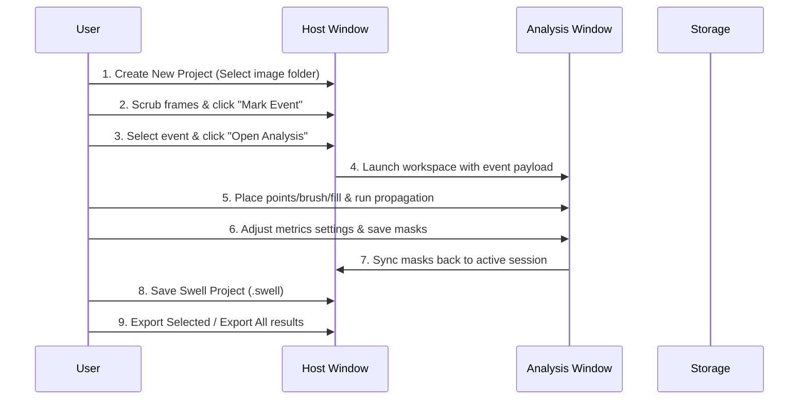

# User Guide

This guide walks you through the complete, end-to-end workflow of using Swell, from first launch through segmentation, saving, and exporting analysis results.

## Workflow Overview

The core Swell workflow consists of two main stages: event cataloging in the **Host Window** and pixel-level segmentation in the **Analysis Window**.

## Tutorial Steps

1. [First Launch & Model Setup](1-first-launch.md)

2. [Creating a Project & Loading Image Stacks](2-load-images.md)

3. [Marking Events](3-mark-events.md)

4. [Opening the Analysis Workspace](4-open-analysis.md)

5. [Segmenting Events](5-segment-events.md)

6. [Running Mask Propagation](6-propagate-masks.md)

7. [Reviewing Diagnostic Overlays](7-review-overlays.md)

8. [Setting Event Metrics](8-event-metrics.md)

9. [Saving Masks & Project Portability](9-save-project.md)

10. [Exporting Results](10-export-results.md)
